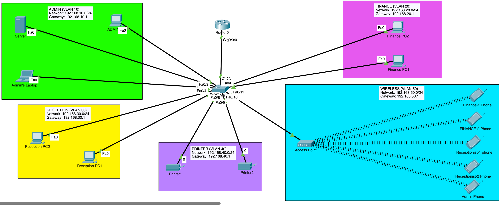

# Small Office Network Lab

## Project Overview
This project showcases a professional-grade network design for a Small Office Home Office (SOHO) environment. It utilizes a **Router-on-a-Stick** architecture to provide inter-VLAN routing, network segmentation for improved security and performance, and automated IP address management via DHCP. The design ensures that different departments (Admin, Finance, Reception) and services (Printers, Wireless) are isolated within their own broadcast domains while maintaining necessary connectivity.

## Repository Structure
```text
.
├── README.md                   # Project Overview & Quick Start
├── configurations/             # Device running configurations
│   ├── dhcp-server-config.txt
│   ├── router-config.txt
│   └── switch-config.txt
├── documentation/             # Technical deep-dives
│   ├── implementation.md
│   ├── ip-addressing-plan.md
│   ├── troubleshooting.md
│   └── vlan-plan.md
├── packet-tracer/              # Simulation files
│   └── small-office-network-lab.pkt
├── screenshots/                # Verification & proof-of-work
│   ├── dhcp-binding.png
│   ├── different-vlan-ping-test.png
│   ├── ip-config-vlan10.png
│   ├── ip-config-vlan20.png
│   ├── ip-config-vlan30.png
│   ├── ip-config-vlan50.png
│   ├── ip-interface.png
│   ├── same-vlan-ping-test.png
│   ├── trunk-interface.png
│   └── vlan-brief.png
└── topology/                   # Network diagrams
    └── topology.png
```

## Network Topology
The topology follows a hierarchical design with a central Router providing gateway services to a Layer 2 Access Switch.



## Quick Start / How to Run
1.  **Prerequisites:** Ensure you have [Cisco Packet Tracer](https://www.netacad.com/courses/packet-tracer) installed.
2.  **Open Project:** Navigate to the `packet-tracer/` directory and open `small-office-network-lab.pkt`.
3.  **Verification:**
    *   Observe the boot sequence of the router and switch.
    *   Verify that end devices (PCs/Laptops) receive IP addresses via DHCP (Wait for the amber lights to turn green).
    *   Open a command prompt on any PC and attempt to ping a device in a different VLAN to verify inter-VLAN routing.

## Documentation Index
*   [VLAN Plan](documentation/vlan-plan.md) - Logical segmentation details.
*   [IP Addressing Plan](documentation/ip-addressing-plan.md) - Subnetting and allocation strategy.
*   [Implementation Guide](documentation/implementation.md) - Step-by-step deployment walkthrough.
*   [Troubleshooting & Verification](documentation/troubleshooting.md) - Testing results and issue resolution.
