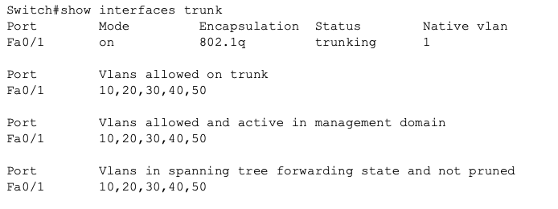
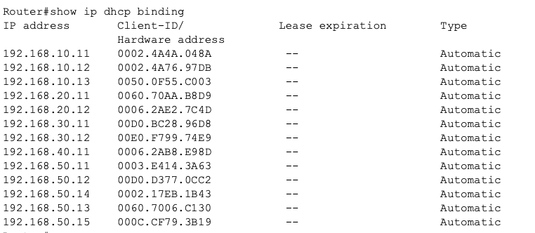
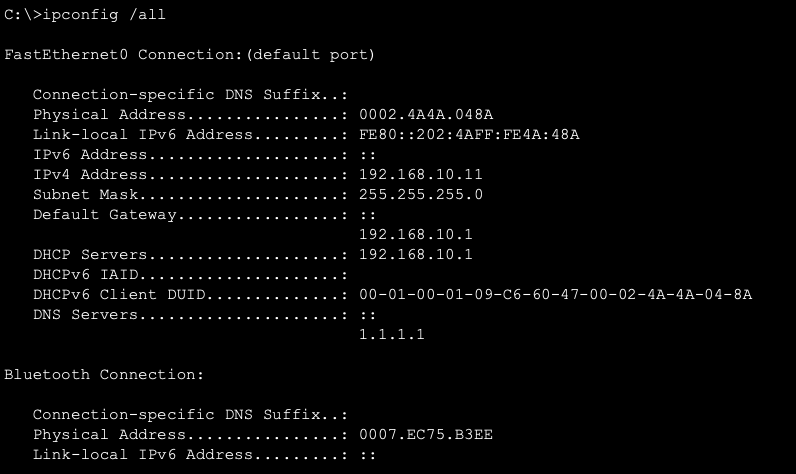
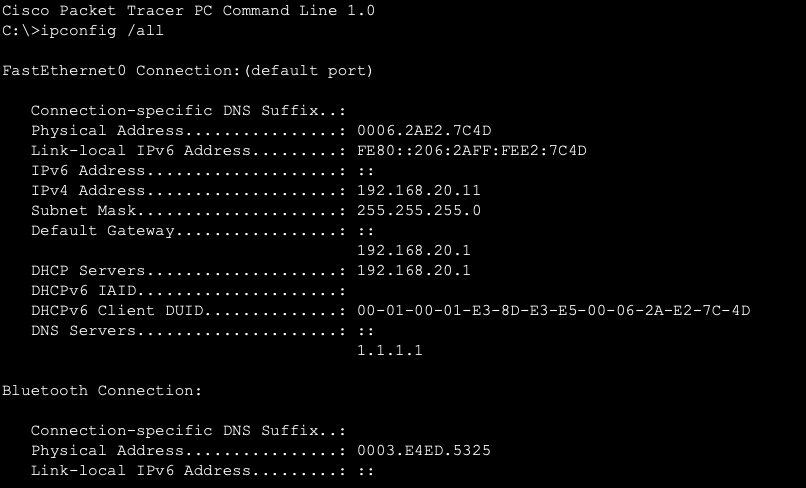

# Implementation Guide

This document provides a step-by-step technical walkthrough of how the Small Office Network was configured and deployed.

## 1. Initial Switch Configuration

The first step was to define the VLANs and assign physical ports to them.

```bash
# Define VLANs
vlan 10
name ADMIN
vlan 20
name FINANCE
vlan 30
name RECEPTION
vlan 40
name PRINTERS
vlan 50
name WIRELESS

# Assign Access Ports
interface range fa0/2-4
switchport mode access
switchport access vlan 10

interface range fa0/5-6
switchport mode access
switchport access vlan 20

# Configure Trunk Link to Router
interface fa0/1
switchport mode trunk
switchport trunk allowed vlan 10,20,30,40,50
```



*Figure 2: Configuration of the trunk link on the switch.*

## 2. Inter-VLAN Routing (Router-on-a-Stick)

The router was configured with sub-interfaces to handle traffic for each VLAN.

```bash
interface gig0/0/0
no shutdown

# Sub-interface for VLAN 10
interface gig0/0/0.10
encapsulation dot1Q 10
ip address 192.168.10.1 255.255.255.0

# Sub-interface for VLAN 20
interface gig0/0/0.20
encapsulation dot1Q 20
ip address 192.168.20.1 255.255.255.0
```

## 3. DHCP Server Configuration

The router was configured as the central DHCP server to automate IP assignment.

```bash
# Exclude gateway and static addresses
ip dhcp excluded-address 192.168.10.1 192.168.10.10
ip dhcp excluded-address 192.168.20.1 192.168.20.10

# Create DHCP Pools
ip dhcp pool ADMIN
network 192.168.10.0 255.255.255.0
default-router 192.168.10.1
dns-server 1.1.1.1

ip dhcp pool FINANCE
network 192.168.20.0 255.255.255.0
default-router 192.168.20.1
dns-server 1.1.1.1
```



*Figure 3: Active DHCP bindings showing leased IP addresses to clients.*

## 4. Verification

After applying the configurations, we verified:
1.  **VLAN Integrity:** Checked `show vlan brief` on the switch.
2.  **Trunk Status:** Checked `show interfaces trunk` on the switch.
3.  **IP Connectivity:** Verified router interfaces with `show ip interface brief`.
4.  **Client Connectivity:** Confirmed clients received correct IP addresses via DHCP.



*Figure 4: PC in VLAN 10 successfully receiving an IP address from the DHCP pool.*



*Figure 5: PC in VLAN 20 successfully receiving an IP address from the Finance DHCP pool.*
