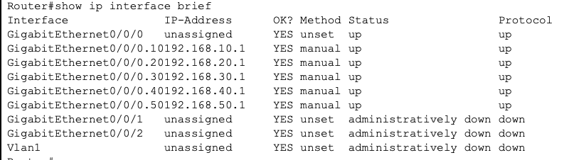

# IP Addressing Plan

This document details the IP addressing strategy and allocation for the Small Office Network. The network uses a private IP addressing scheme to ensure efficient internal communication and security.

## Addressing Strategy

The network utilizes a **Class C (192.168.0.0/16)** private address space. We have implemented a fixed-length subnet mask (FLSM) of `/24` (255.255.255.0) for each department, providing up to 254 usable addresses per VLAN, which is more than sufficient for the current and future growth of this small office.

*   **Base Network:** 192.168.0.0/16
*   **Subnet Mask:** 255.255.255.0 (/24)
*   **Gateway Address:** The first usable IP address in each subnet (`.1`) is reserved for the default gateway (Router sub-interface).
*   **DHCP Reservations:** The first 10 addresses (`.1` to `.10`) in each subnet are excluded from the DHCP pool and reserved for static assignments (Gateways, Servers, Printers).

## IP Allocation Table

| Device Name | Interface | IP Address | Subnet Mask | Purpose |
| :--- | :--- | :--- | :--- | :--- |
| **Router** | Gig0/0/0.10 | 192.168.10.1 | 255.255.255.0 | Gateway for ADMIN VLAN |
| **Router** | Gig0/0/0.20 | 192.168.20.1 | 255.255.255.0 | Gateway for FINANCE VLAN |
| **Router** | Gig0/0/0.30 | 192.168.30.1 | 255.255.255.0 | Gateway for RECEPTION VLAN |
| **Router** | Gig0/0/0.40 | 192.168.40.1 | 255.255.255.0 | Gateway for PRINTERS VLAN |
| **Router** | Gig0/0/0.50 | 192.168.50.1 | 255.255.255.0 | Gateway for WIRELESS VLAN |
| **PC-Admin** | FastEthernet0 | DHCP (192.168.10.11+) | 255.255.255.0 | End-user device in Admin |
| **PC-Finance** | FastEthernet0 | DHCP (192.168.20.11+) | 255.255.255.0 | End-user device in Finance |
| **Laptop-Guest** | Wireless | DHCP (192.168.50.11+) | 255.255.255.0 | Wireless end-user device |

*Figure 2: Summary of IP addresses assigned to the Router's sub-interfaces.*

## DHCP Configuration

The router acts as the DHCP server for all VLANs.

| Pool Name | Network | Default Gateway | DNS Server | Excluded Range |
| :--- | :--- | :--- | :--- | :--- |
| ADMIN | 192.168.10.0/24 | 192.168.10.1 | 1.1.1.1 | 192.168.10.1 - .10 |
| FINANCE | 192.168.20.0/24 | 192.168.20.1 | 1.1.1.1 | 192.168.20.1 - .10 |
| RECEPTION | 192.168.30.0/24 | 192.168.30.1 | 1.1.1.1 | 192.168.30.1 - .10 |
| PRINTER | 192.168.40.0/24 | 192.168.40.1 | 1.1.1.1 | 192.168.40.1 - .10 |
| WIRELESS | 192.168.50.0/24 | 192.168.50.1 | 1.1.1.1 | 192.168.50.1 - .10 |
